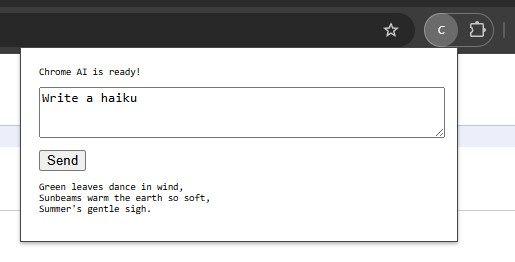

# Simple Chromium AI

A lightweight TypeScript wrapper for Chrome's built-in AI APIs (Prompt, Translator, Language Detector, and Summarizer) that trades flexibility for simplicity and type safety.

## Why Use This?

Chrome's native AI APIs are powerful but require careful initialization and session management. This wrapper provides:

- **Automatic error handling** - Graceful failures with clear messages
- **Simplified API** - Common tasks in one function call
- **Safe API variant** - Result types instead of throwing

For advanced use cases requiring more control, use the [original Chrome AI APIs](https://developer.chrome.com/docs/ai/built-in-apis) directly.

## Quick Start

```bash
npm install simple-chromium-ai
```

```javascript
import { Prompt, translate, detect, summarize } from 'simple-chromium-ai';

// Prompt API — create a reusable instance
const ai = await Prompt.create({ systemPrompt: "You are a helpful assistant" });
const response = await ai.prompt("Write a haiku");

// Translator, Detector, Summarizer — one-shot, no setup needed
const translated = await translate("Hello", { sourceLanguage: "en", targetLanguage: "es" });
const detections = await detect("Bonjour le monde");
const summary = await summarize("Long article...", { type: "tldr" });
```

## Prerequisites

- Chrome 138+ for Translator, Language Detector, and Summarizer APIs
- Chrome 148+ for Prompt API
- See [hardware requirements](https://developer.chrome.com/docs/ai/get-started#hardware) — models are downloaded on-device (~4GB)

## Prompt API

```typescript
import { Prompt } from 'simple-chromium-ai';

const ai = await Prompt.create({
  systemPrompt: "You are a helpful assistant",
  expectedOutputLanguages: ["en"], // defaults to ["en"]
});

const response1 = await ai.prompt("Write a haiku");
const response2 = await ai.prompt("Write another");
ai.destroy();
```

### One-Shot

For a single prompt without reuse, use the flat export:

```typescript
import { prompt } from 'simple-chromium-ai';

const response = await prompt("Write a haiku", {
  systemPrompt: "You are a poet",
  timeout: 5000,
});
```

### Session Management

```typescript
// Create reusable session (maintains conversation context)
const session = await ai.createSession();
const response1 = await session.prompt("Hello");
const response2 = await session.prompt("Follow up");
session.destroy();

// Override the instance's system prompt for this session
const customSession = await ai.createSession({
  initialPrompts: [{ role: 'system', content: 'You are a pirate' }]
});

// Or use withSession for automatic cleanup
const result = await ai.withSession(async (session) => {
  return await session.prompt("Hello");
});
```

### Token Management
```typescript
const usage = await ai.checkTokenUsage("Long text...");
if (!usage.willFit) {
  // Prompt is too long for the context window
}
```

### Structured Output
```javascript
const response = await ai.prompt("Analyze the sentiment: 'I love this!'", {
  promptOptions: {
    responseConstraint: {
      type: "object",
      properties: {
        sentiment: { type: "string", enum: ["positive", "negative", "neutral"] },
        confidence: { type: "number" }
      },
      required: ["sentiment", "confidence"]
    }
  }
});
const result = JSON.parse(response);
```

### Cancellation
```javascript
const controller = new AbortController();

const response = await ai.prompt("Write a detailed analysis...", {
  promptOptions: { signal: controller.signal }
});

// Cancel from elsewhere:
controller.abort();
```

## Translator API

```typescript
import { translate } from 'simple-chromium-ai';

const translated = await translate("Hello", {
  sourceLanguage: "en",
  targetLanguage: "es",
});
```

For multiple translations with the same language pair, create a reusable instance:

```typescript
import { Translator } from 'simple-chromium-ai';

const translator = await Translator.create({
  sourceLanguage: "en",
  targetLanguage: "ja",
});
const result1 = await translator.translate("Hello");
const result2 = await translator.translate("Goodbye");
translator.destroy();
```

## Language Detector API

```typescript
import { detect } from 'simple-chromium-ai';

const detections = await detect("Bonjour le monde");
// Returns: [{ detectedLanguage: "fr", confidence: 0.95 }, ...]
```

## Summarizer API

```typescript
import { summarize } from 'simple-chromium-ai';

const summary = await summarize("Long article text...", {
  type: "tldr",       // "tldr" | "key-points" | "teaser" | "headline"
  length: "medium",   // "short" | "medium" | "long"
});
```

For multiple summarizations with the same options, create a reusable instance:

```typescript
import { Summarizer } from 'simple-chromium-ai';

const summarizer = await Summarizer.create({ type: "key-points", length: "short" });
const summary1 = await summarizer.summarize("First article...");
const summary2 = await summarizer.summarize("Second article...");
summarizer.destroy();
```

## Safe API

Every function has a Safe variant that returns Result types instead of throwing:

```typescript
import ChromiumAI from 'simple-chromium-ai';

const result = await ChromiumAI.Safe.Prompt.create({ systemPrompt: "You are helpful" });
result.match(
  async (ai) => {
    const response = await ai.prompt("Hello");
    response.match(
      (value) => console.log(value),
      (error) => console.error(error.message)
    );
  },
  (error) => console.error(error.message)
);
```

One-shot safe variants are also available as flat exports:

```typescript
import { safePrompt, safeTranslate, safeDetect, safeSummarize } from 'simple-chromium-ai';

const result = await safeTranslate("Hello", { sourceLanguage: "en", targetLanguage: "es" });
result.match(
  (text) => console.log(text),
  (error) => console.error(error.message)
);
```

## Limitations

This wrapper prioritizes simplicity over flexibility. It does not expose:

- Streaming responses (`promptStreaming()`, `translateStreaming()`, `summarizeStreaming()`)
- Writer and Rewriter APIs
- Proofreader API

For these features, use the [native Chrome AI APIs](https://developer.chrome.com/docs/ai/built-in-apis) directly.

## Demo Extension

A minimal Chrome extension demo is included in the `demo` folder.



**[Available on the Chrome Web Store](https://chromewebstore.google.com/detail/fihhgimeakbpnioianlhlejlblefeegn)**

To run locally:
```bash
cd demo
npm install
npm run build
# Load the demo/dist folder as an unpacked extension in Chrome
```

## Troubleshooting

1. Navigate to `chrome://on-device-internals/` to check model status

2. Check availability in the DevTools console:
   ```javascript
   await LanguageModel.availability()
   // Returns: "available" | "downloadable" | "downloading" | "unavailable"
   ```

3. If `"downloadable"`, trigger the download:
   ```javascript
   await LanguageModel.create({
     monitor(m) {
       m.addEventListener('downloadprogress', (e) => {
         console.log(`Downloaded ${e.loaded * 100}%`);
       });
     },
   });
   ```

   The library also triggers downloads automatically when you call any API function.

## Resources

- [Chrome Built-in AI APIs Overview](https://developer.chrome.com/docs/ai/built-in-apis)
- [Prompt API](https://developer.chrome.com/docs/ai/prompt-api)
- [Translator API](https://developer.chrome.com/docs/ai/translator-api)
- [Language Detector API](https://developer.chrome.com/docs/ai/language-detection)
- [Summarizer API](https://developer.chrome.com/docs/ai/summarizer-api)
- [Structured Output](https://developer.chrome.com/docs/ai/structured-output-for-prompt-api)
- [W3C Prompt API Spec](https://github.com/webmachinelearning/prompt-api)

## License

MIT
